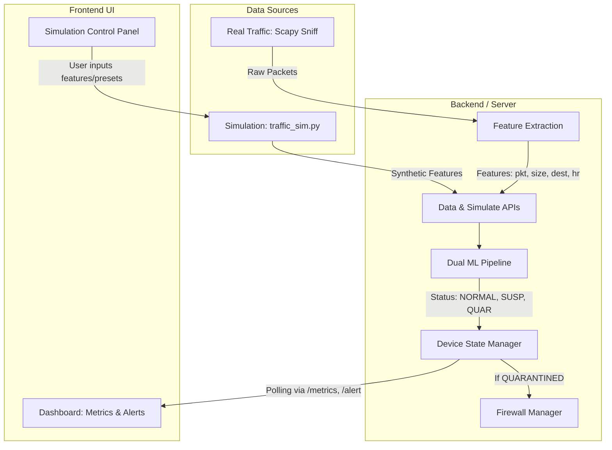

# AEIS (Autonomous Edge Immunity System) — 360-Degree Architectural Breakdown

This document provides a comprehensive, end-to-end explanation of the AEIS cybersecurity project. It is structured to serve as primary documentation for team understanding, system design review, and presentation preparation.

---

## 🧩 1. Project-Level Overview

### What the Project Does
AEIS is a real-time, multi-device IoT security dashboard and active defense system. It monitors network traffic generated by IoT devices (specifically simulated and real IP cameras), detects anomalies using machine learning, automatically isolates compromised devices, and autonomously heals them back to normal operation once the threat passes.

### The Problem It Solves
IoT devices (like security cameras) are notoriously insecure and prime targets for botnets (e.g., Mirai), DDoS participation, and data exfiltration. AEIS solves this by providing **edge-level anomaly detection and autonomous response**. Instead of waiting for a human admin to notice an attack, AEIS detects the attack in seconds, cuts off the device from the network to stop the spread, and automatically restores it when it is safe.

### High-Level Architecture Pipeline
The system operates on a four-stage autonomous loop:
1. **Collect:** Network traffic is continuously sniffed (via Scapy) or generated synthetically in fixed time windows (e.g., 5 seconds). Features are extracted.
2. **Detect:** Features are passed through a dual Machine Learning pipeline (Isolation Forest + Random Forest) alongside hard rule-based thresholds.
3. **Respond:** Depending on the threat level, the system triggers alerts, UI status changes (NORMAL → SUSPICIOUS), or active mitigation like firewall blocking (QUARANTINED).
4. **Heal:** A state machine guides a quarantined device through a recovery process (QUARANTINED → HEALING → RECOVERING → NORMAL) while actively learning from the attack signature to bolster future immunity.

---

## 🧩 2. End-to-End Data Flow

The following text-based diagram illustrates how data flows step-by-step from the network to the user interface.

1. **Input Source:** Data either comes from `traffic_capture.py` sniffing live network interfaces or `traffic_sim.py` generating statistical synthetic features based on attack presets.
2. **Feature Extraction:** Raw traffic is summarized per time window into four core features: packet count, average packet size, destination IP count, and time of day.
3. **ML Model (`_run_ml`):** The server receives these features via `/data` or `/simulate`. It engineers secondary features, evaluates them using pre-trained Isolation Forest and Random Forest models, and checks dynamic hard limits.
4. **Detection Output:** The logic outputs a conclusive state: `NORMAL`, `SUSPICIOUS`, or `QUARANTINED`.
5. **Server State & APIs:** The server updates the isolated `device_state` dictionary for the specific camera and exposes this state via `/metrics`, `/alert`, and `/status` APIs.
6. **UI Dashboard:** The JavaScript frontend (`app.js`) polls these endpoints every 3 seconds and dynamically updates charts, threat bars, and logs based on the server's state.

---

## 🧩 3. Module Breakdown

### 🔹 Collect Layer
**Function:** Gathers network telemetry without deep packet inspection (privacy-preserving).
**Mechanism:** `traffic_capture.py` uses BPF filters to sniff packets for a target IP over a window (e.g., 5s).
**Features Created:**
- `packets_per_window`: Volume of traffic (detects DDoS/Floods).
- `avg_packet_size`: Payload size (detects data exfiltration or ping floods).
- `dest_count`: Number of unique destination IPs (detects port/network scanning).
- `activity_hour`: Current hour 0-23 (detects off-hours suspicious activity).

### 🔹 Detect Layer
**Function:** Analyzes the extracted features to determine the threat level.
**Mechanism:** Uses a dual-model approach:
- **Isolation Forest (Unsupervised):** Detects novel, unseen anomalies (zero-day attacks).
- **Random Forest (Supervised):** Accurately classifies known attack patterns.
- **Rule-Based Thresholds:** Fast-path hard limits (e.g., >12,000 packets) that override ML models for immediate action.
**Outputs:** 
- `NORMAL` (Low Threat)
- `SUSPICIOUS` (Medium Threat - anomaly detected but not critical)
- `QUARANTINED` (High Threat - critical threshold breached)

### 🔹 Respond Layer
**Function:** Takes immediate action based on detection.
**Mechanism:** 
- **Alert Generation:** Updates internal state logs and UI threat indicators.
- **Quarantine Logic:** If `QUARANTINED` is triggered, `server.py` calls `_block_device()`, which uses Windows `netsh advfirewall` to instantly block all inbound traffic from the compromised IP.

### 🔹 Heal Layer
**Function:** Manages the recovery of isolated devices and improves future resilience.
**Mechanism:** 
- **Cooldown:** A 10-second penalty phase where the device remains quarantined.
- **State Transition:** 
  `QUARANTINED` → (cooldown) → `HEALING` (needs stable traffic) → `RECOVERING` (SUSPICIOUS visual state) → `NORMAL` (unblocked).
- **Adaptive Immunity:** When quarantined, the exact attack features are saved to `attack_memory`. Future detection thresholds are mathematically lowered (up to 15% more sensitive) based on the size of this memory, meaning the system learns and reacts faster to repeated attacks.

---

## 🧩 4. Backend (Server) Explanation

The backend is a Flask API (`server.py`) acting as the brain of AEIS. It runs inference, maintains state, and manages the firewall.

**Core APIs:**
- `POST /data`: Receives real traffic features from the capture script. Automatically triggers ML inference and potential firewall blocking for `cam1`.
- `POST /simulate`: Receives synthetic features or preset commands from the simulation UI. Runs ML inference without applying real firewall rules.
- `GET /metrics`: Returns current live feature values (packets, size, etc.) for a specific device.
- `GET /alert`: Returns the current ML probability scores, threat level, and system status (NORMAL/SUSP/QUAR).
- `GET /status`: Returns high-level server health and connection status for all tracked devices.
- `GET /heal_status`: Returns exact metrics on cooldowns and stability counts for the healing UI.
- `GET /force/<st>` & `POST /reset`: Manual override endpoints for demonstrations and immediate recovery.

**Data & State Management:**
State is maintained strictly in-memory using a `device_state` dictionary. Each device (`cam1`, `cam2`) has its own independent nested dictionary tracking its feature history, healing phase, and immune memory. Thread locks (`device_locks`) ensure race conditions don't occur when simultaneous simulated and real data arrive.

---

## 🧩 5. Frontend (UI) Explanation

The UI is a cyberpunk-themed, dark-mode dashboard built with Vanilla HTML/CSS/JS.

**Dashboard Behavior (`app.js` & `index.html`):**
- Operates as a single-page application (SPA).
- **Device Connection Logic:** Polls `/status` and `/metrics`. If a device hasn't updated its state in 30 seconds, it visually disconnects.
- **Metrics Display:** Uses Chart.js for live packet plotting and visual progress bars for feature thresholds. 
- **Status Colors:** 
  - 🟢 **Green (NORMAL):** Healthy traffic.
  - 🟡 **Yellow (SUSPICIOUS):** Anomalies detected; triggers user-friendly warning popups.
  - 🔴 **Red (QUARANTINED):** Attack confirmed; visual lockdown (red borders, threat maxed).
  - 🔵 **Blue/Cyan (HEALING/RECOVERING):** Visually communicates the autonomous recovery phase.
- **CCTV Dependency:** Cameras are categorized under 'server-dependent' devices.

**Simulation Panel (`simulate.js` & `simulate.html`):**
- Completely detached from the main monitoring dashboard.
- Allows users to inject specific attack parameters via sliders (DDoS, Exfiltration, etc.) or presets.
- Connects directly to the `/simulate` endpoint to bypass real network capture for testing purposes.

---

## 🧩 6. Simulation System

The simulation engine (`traffic_sim.py`) is statistical and synthetic—it generates data *shapes* that look like attacks, without sending actual network packets.

**How Attacks are Simulated:**
Instead of flooding the network, `traffic_sim.py` uses random distribution bands based on intensity:
- **DDoS:** High `packets_per_window`, low `avg_packet_size`, low `dest_count`.
- **Port Scan:** Normal packets, small size, massive `dest_count`.
- **Exfiltration:** Low packets, massive `avg_packet_size` (near MTU limit).
- **Suspicious Timing:** Normal traffic, but forced into `activity_hour` between 12 AM and 6 AM.

**Control:** The frontend `simulate.js` uses a continuous `setInterval` loop to fire these generated features at the `/simulate` endpoint for a specified duration, driving the dashboard charts exactly like live data would.

---

## 🧩 7. Device Architecture

AEIS natively supports Multi-Device tracking. 

**Independent States:**
In `server.py`, `cam1` and `cam2` possess deeply separate state dictionaries. 
- If `cam1` is targeted by a DDoS and is quarantined, `cam2` remains completely `NORMAL`.
- `cam2` utilizes a dedicated background daemon thread (`_cam2_feeder()`) that continuously injects normal synthetic traffic every 5 seconds. This ensures the dashboard always has active, moving data for demo purposes, proving the system can handle parallel, asynchronous data streams without state bleeding.

---

## 🧩 8. Detection Logic & Thresholds

The system triangulates threats using both ML and hard logical heuristics:
1. **Machine Learning:** 
   - Feature arrays are engineered (e.g., adding rolling averages or variance).
   - If *both* Random Forest and Isolation Forest flag the data as anomalous (exceeding their `.npy` threshold arrays), the device goes `SUSPICIOUS`.
2. **Hard Thresholds (Rule-Based Overrides):**
   - **Packets:** >9,000 = `SUSPICIOUS` | >12,000 = `QUARANTINED`
   - **Size:** >1,350B = `SUSPICIOUS` | <600B (with high packet count) = `QUARANTINED`
   - **Destinations:** >5 = `SUSPICIOUS` | >10 = `QUARANTINED`
3. **Adaptive Thresholds:** If a device has been attacked before, the `_adaptive_thresholds` function shrinks these hard limits by up to 15%, making the system "jumpier" and more secure against repeat offenders.

---

## 🧩 9. Design Decisions (IMPORTANT)

- **Why Synthetic vs Real Traffic?** 
  Generating real DDoS traffic on a local network can crash routers and disrupt actual work. Synthetic features allow safe, reliable, and demonstratable testing of the ML pipeline without network destruction. Real traffic (`traffic_capture.py`) was added to prove real-world viability.
- **Why ML instead of only rules?**
  Rules (like >10,000 packets) are brittle and easily evaded by "low-and-slow" attacks. ML (specifically Isolation Forest) looks at the *relationship* between features (e.g., normal packet counts, but unusual sizes at an unusual hour), catching sophisticated threats that bypass static firewalls.
- **Why these 4 specific features?**
  They are lightweight. Deep Packet Inspection (DPI) requires decrypting SSL/TLS and uses massive CPU. By only looking at packet *headers* (count, size, IP), AEIS respects user privacy (no payload reading) and runs blazingly fast on low-power edge devices (like Raspberry Pis).
- **Why separate Simulation from Dashboard?**
  Separation of concerns. The dashboard represents the "Admin View." The simulation represents the "Hacker's terminal." Mixing them confuses the UX and makes the dashboard feel like a toy rather than a monitoring tool.

---

## 🧩 10. Strengths & Limitations

### ✅ Strengths
- **Real-Time Speed:** Analyzes and reacts to threats in under 5 seconds.
- **Autonomous Healing:** Reduces admin fatigue by automatically recovering isolated devices.
- **Privacy First:** Header-only ML analysis; zero payload inspection.
- **Adaptive Immunity:** Gets smarter and more sensitive after every attack.
- **Modular Architecture:** Flask backend and Vanilla JS frontend allow easy swapping of ML models or UI themes.

### ⚠️ Limitations
- **Threshold Tuning:** Hard thresholds might need manual adjustment depending on the specific brand/model of the IoT camera (some cameras naturally stream 4K video, triggering false positives on packet size).
- **Firewall Dependency:** Active response currently relies on Windows `netsh`. Deploying to Linux/routers requires rewriting the `_block_device()` function for `iptables` or router APIs.
- **Synthetic Reliance for Training:** If the ML models are trained heavily on synthetic data, they may struggle with the nuanced noise of highly chaotic real-world environments without fine-tuning.

---

## 🧩 11. Interview / Presentation Explanation

### 🎤 Simple Explanation (For Non-Technical Audience/Management)
> "AEIS is like a digital immune system for smart homes. Imagine your security camera gets hacked by a virus and starts trying to attack other computers. AEIS watches the flow of data like a security guard. The moment it sees the camera acting strangely—like sending too much data in the middle of the night—AEIS instantly locks it in a digital quarantine room so it can't harm your network. Once the camera calms down and acts normal again, AEIS automatically lets it out of quarantine, and it remembers that exact attack so it can catch it even faster next time."

### 💻 Technical Explanation (For Engineers/Interviewers)
> "AEIS is an edge-based network intrusion detection and response pipeline. We capture layer 3 and 4 telemetry in 5-second tumbling windows without performing DPI, specifically extracting flow volume, byte distribution, destination cardinality, and temporal markers. This feature vector is passed into a Flask microservice where it is evaluated by a dual-model ensemble: an Isolation Forest for unsupervised zero-day anomaly detection, and a Random Forest for supervised attack signature classification. If inference confidence crosses dynamic, immune-adjusted thresholds, a state machine triggers an automated OS-level firewall block. The system then enters an autonomous healing loop, requiring 'n' consecutive normal inference windows to step down from a Quarantined state back to a fully routing Normal state."
